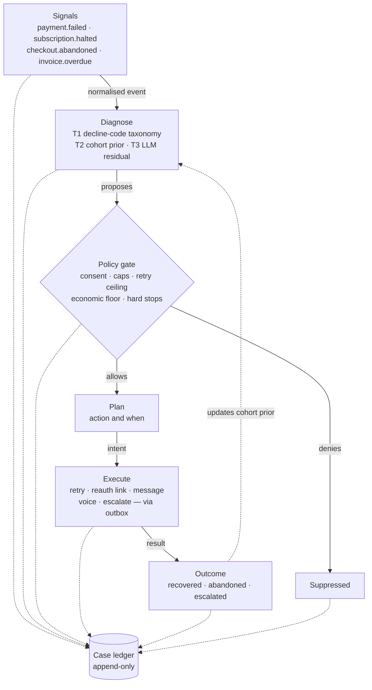
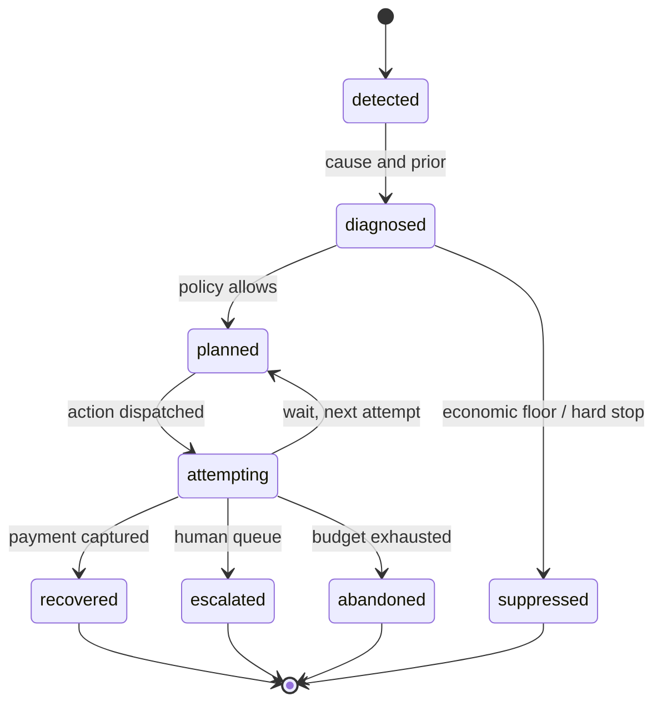
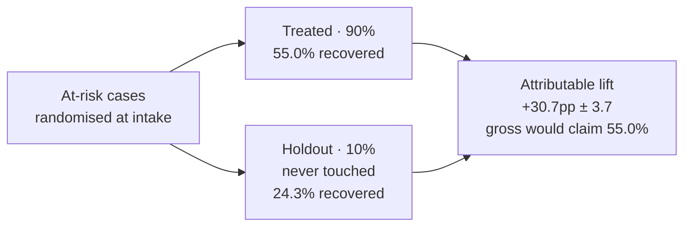

# Backstop — Architecture

**Razorpay AI Buildathon · Track 03, AI Revenue Recovery · v0.1**

An agent that detects revenue at risk, diagnoses why it is leaking, and executes
bounded recovery workflows — under a compliance budget it is not allowed to overspend.

Every section below links to the code that implements it.

---

## 1. Recovery is a decision problem, not a writing problem

The obvious build for this track is an LLM that writes better dunning emails. That
build loses, because none of the four acceptance criteria are about generation
quality. All four are about restraint and proof.

> Every at-risk rupee is a sequential decision under a compliance budget. **The model
> proposes; a deterministic policy engine disposes.** Nothing reaches a customer that a
> rule did not permit and a ledger did not record.

That inversion drives the whole architecture. The LLM is one narrow,
schema-constrained component sitting on the residual cases that structured signals
cannot classify — it defaults to [`NoLLM`](src/backstop/diagnosis/engine.py), which
refuses rather than guessing. Everything that decides whether to spend a contact, a
retry or a phone call is ordinary, versioned, unit-tested code, because those are the
parts a panel will interrogate and "the model decided" is not an answer.

The second consequence is that **measurement is a product surface, not a spreadsheet**.
A system that recovers ₹1 crore is unimpressive if ₹0.9 crore would have self-recovered
untouched.

## 2. The stated bar, mapped to components

| Stated bar | Component | Artefact |
|---|---|---|
| Measurable money recovered across batch processing | [`measurement/report.py`](src/backstop/measurement/report.py) | Batch headline: at risk in, gross, **incremental ± 95% CI**, net of action cost |
| Compliant escalation protocols | [`policy/rules.py`](src/backstop/policy/rules.py) | PR-01…PR-08 recorded per decision, with the config version |
| Stopping rules and audit trails | [`policy/`](src/backstop/policy) + [`ledger/`](src/backstop/ledger) | The **Why-not view** — suppressed cases with the rule that stopped each — plus full replay of any case |
| Evidence beyond cherry-picked successes | [`measurement/report.py`](src/backstop/measurement/report.py) | Lift decomposed by cause, amount band and issuer, with per-cohort sample sizes |

Nothing else in this document matters more than that table. Every design choice below
exists to make one of those four rows credible.

## 3. System shape

Six stages, strictly ordered, all writing into one append-only ledger. The policy gate
sits **between** diagnosis and planning, not after it — an action a rule forbids is
never planned, never queued, and never has to be recalled.



Remove the gate and the `Suppressed` branch disappears along with every stopping rule
in the system.

## 4. One append-only ledger

A single immutable event table plus a derived case projection. Signals, diagnoses,
policy decisions, dispatched intents, executor results and outcomes are all rows of
the same shape. Audit trail and replay fall out of this rather than being bolted on —
which is the whole reason to pay the write-amplification cost.

```
case_event
  event_id      uuid, monotonic within case
  case_id       uuid
  kind          detected | diagnosed | policy_decided | intent_queued
                | action_result | outcome | note
  payload       jsonb   — schema per kind, versioned
  rule_ids      text[]  — every rule that fired, allowing or not
  actor         system | policy | planner | operator:<id>
  idem_key      text unique — no transition applied twice
  occurred_at   timestamptz
```

The case projection is a materialised view over that log. If the projection is ever
wrong it is rebuilt, not patched — there is exactly one source of truth, and it is the
log.

Implemented in [`ledger/store.py`](src/backstop/ledger/store.py) (protocol +
in-memory) and [`ledger/sqlite.py`](src/backstop/ledger/sqlite.py), which carries the
same schema. The uniqueness constraint on `idem_key` enforces exactly-once, not
application code.

## 5. Case lifecycle



**Suppression is reached from `diagnosed`, not from `attempting`.** A suppressed case
is a decision the system made, not an attempt that failed, and mixing the two would
corrupt the reporting. The state machine enforces it —
[`TRANSITIONS`](src/backstop/domain/case.py) raises on the illegal edge, and there is
a test for it.

The `attempting → planned` edge is where retry timing lives: a case cycles until a
rule closes its budget.

## 6. Diagnosis — deterministic first, model last

| Tier | Method | Handles | Output |
|---|---|---|---|
| **T0** | [Network advice](src/backstop/diagnosis/advice.py) | Mastercard Merchant Advice Code, Visa decline category — read off the decline response | Retry eligibility, and often the retry time itself |
| **T1** | [Decline-code taxonomy](src/backstop/diagnosis/taxonomy.py) | insufficient funds · expired instrument · issuer unavailable · 3DS abandonment · risk decline · `do_not_honour` | Cause class + coarse recoverability |
| **T2** | [Cohort posterior](src/backstop/diagnosis/cohort.py) | Beta–Bernoulli over `(issuer × instrument × amount band × hour)` | P(recover), with sample size |
| **T3** | [LLM, schema-constrained](src/backstop/diagnosis/engine.py) | Unstructured residual only — email threads, replies, free-text notes | Same `Diagnosis` struct, evidence spans required |

### T0 outranks everything

The network frequently tells you what to do, and that instruction beats anything
inferred from a code table or learned from a cohort — it knows the account is closed,
and it knows when the issuer will next look favourably on the transaction.

| Advice | Meaning | Effect |
|---|---|---|
| MAC `03`, `21` · Visa cat `1` | Do not try again | Retry never proposed; PR-04 denies it as defence in depth. Reattempting is a per-attempt fee, not just a wasted call |
| MAC `01`, `04` · Visa cat `3` | Credential is the problem | Retry replaced by a reauth link — the customer has to act |
| MAC `24`–`30` | Retry after 1h / 24h / 2, 4, 6, 8, 10 days | Becomes the retry window, overriding the learned offset |
| MAC `02` · Visa cat `2`, `4` | Retryable, no stated time | Falls through to the cohort prior |

An unrecognised code parses to *no advice* rather than to a guess: inventing permission
the network did not grant is the failure mode this tier exists to prevent. Roughly a
third of simulated declines carry no advice at all, and the system falls back to T1/T2.

`do_not_honour` deserves its own note: it is the most common and least informative
decline in the book, and treating it as a single class is how retry strategies earn
their reputation for spamming issuers. Backstop splits it by cohort behaviour rather
than by code — if a given issuer's `do_not_honour` cohort recovers on a T+2 retry,
that is an empirical fact the posterior learns, not a rule anyone wrote.

**Non-negotiable:** every `Diagnosis` carries `evidence[]` pointing at raw event
fields. One that cannot cite its inputs raises `EvidenceRequired` at construction —
including, especially, a T3 one.

## 7. The policy engine

Declarative, versioned, unit-tested rules evaluated on every proposed action. This is
where "bounded", "compliant" and "stopping rules" are actually satisfied, and it
contains no model inference at all. See [`policy/rules.py`](src/backstop/policy/rules.py).

Four dispositions, deliberately distinct — collapsing them is how compliance bugs hide:

- **deny** — this action, now, on this channel. Others may still be allowed.
- **defer** — right action, wrong time. Re-queued, never dropped.
- **suppress** — this case is not worth working. Terminal until new information.
- **hard stop** — cease all contact. Terminal and irreversible.

### Rule set

| Rule | Trigger | Disposition |
|---|---|---|
| `PR-01 CONSENT` | No channel consent; or promotional contact to a DND-registered number | deny that channel |
| `PR-02 PROMO_HOURS` | Promotional contact (or any voice call) outside 10:00–21:00 IST | defer to next open slot |
| `PR-03 FREQ_CAP` | Contacts per channel per rolling window exceeded | deny |
| `PR-04 RETRY_CEILING` | Network reattempt ceiling in 30d, merchant cap, or spacing not met | deny the retry only |
| `PR-05 MANDATE_NOTICE` | e-mandate debit without 24h pre-debit notice, or above the AFA ceiling without authentication | defer / deny |
| `PR-06 ECON_FLOOR` | Expected recovery ≤ expected cost | suppress |
| `PR-07 HARD_STOP` | Opt-out, dispute, chargeback, refund, or fraud flag | hard stop |
| `PR-08 PROMISE_HOLD` | Promise-to-pay recorded | defer until promised date + grace |

### The economic floor

```
act only if   amount × P(recover) × margin  >  action_cost + goodwill_cost
```

One rule, and it removes the entire class of "contact everyone and see what sticks"
behaviour that makes recovery agents unshippable. `goodwill_cost` rises with each
prior contact on the case, so the tenth message has to clear a bar the first one did
not.

### Service vs promotional communication

TCCCPR draws a line that materially changes which rules apply, so
[`MessageClass`](src/backstop/domain/types.py) is a first-class field on every action:

- **Service** — a failed subscription debit, a mandate lapse, an overdue invoice.
  Concerns an existing relationship. Not DND-scrubbed, not confined to promotional
  hours.
- **Promotional** — a checkout-abandonment nudge. An inducement to transact. DND
  applies, and delivery is confined to 10:00–21:00 IST.

Getting this wrong is expensive in both directions: treating everything as
promotional means refusing to tell a customer their payment failed because they are
DND-registered, and treating everything as service means sending marketing at 2am. An
`Action` that omits its class defaults to `PROMOTIONAL`, so a forgetful caller gets
the safer treatment.

Voice calls are held to promotional hours regardless of class — nobody wants a
collections call at 2am, whatever the regulation permits.

### Configuration, not constants

Thresholds are set by regulation and by each merchant, and they change. Rule
*identities* are stable; the numbers are versioned config in
[`policy/config.py`](src/backstop/policy/config.py), and both the rule ID and the
config version land in `rule_ids` on every decision.

**`cfg-2026.09.1` — verified 2026-09-05** against the sources cited in the config
module docstring, and pinned by
[`tests/test_regulatory.py`](tests/test_regulatory.py) so that a regulator moving a
number fails a test that names the rule:

| Constant | Value | Source |
|---|---|---|
| Pre-debit notification lead time | 24 hours | RBI Digital Payments E-Mandate Framework 2026, circular `RBI/CO.DPSS.POLC.No.S56/02.14.003/2026-27` (21 Apr 2026) |
| AFA ceiling, general | ₹15,000 | same |
| AFA ceiling, insurance / mutual fund / credit card bill | ₹1,00,000 | same |
| Promotional contact window | 10:00–21:00 IST | TRAI TCCCPR 2018, as amended |
| DND scrubbing | promotional only | same |
| Visa reattempt ceiling | 15 per declined transaction / 30 days | Visa card-not-present reattempt rules |
| Mastercard reattempt ceiling | 10 per 30 days | Mastercard reattempt rules |
| Unknown network | 10 (the stricter) | conservative default |
| Merchant per-case retry cap | 3 | merchant policy, deliberately far under both ceilings |
| Mastercard MAC table | `01`–`04`, `21`, `24`–`30` | Mastercard Merchant Advice Codes (DE 48 se 84) |
| Visa decline categories | `1`–`4` | Visa decline response category grouping |

Network limits are the ceiling, not the target: the economics stop paying long before
the compliance limit binds, which is why the merchant cap is 3 and PR-06 usually fires
first.

## 8. Planner — timing over copy

Given a diagnosis and the policy-allowed action set, choose the next action *and when
it fires*. Timing is the larger lever by some distance: retrying an
`insufficient_funds` decline the day after salary credit beats any rewrite of the
message that accompanies it. So `wait(until)` is a first-class action, and it is the
default one. See [`planner/planner.py`](src/backstop/planner/planner.py).

| Action | Bound by |
|---|---|
| `wait(until)` | Nothing — the default. Doing nothing is always available. |
| `retry_payment(at, instrument)` | PR-04, PR-05 |
| `switch_instrument(to)` | Stored instrument + consent on file |
| `request_reauth_link(ttl)` | One live link per case; a new one supersedes |
| `send_message(channel, tmpl)` | PR-01, PR-02, PR-03 |
| `voice_call(script, lang)` | PR-01, PR-02; human handoff on ambiguity |
| `offer_installment(plan)` | Merchant-configured ceiling |
| `escalate_human(queue)` | Always permitted; never counted as a recovery |
| `close_case(reason)` | Terminal; reason code required, free text refused |

Selection is a scored policy over `(action, template, timing)` with ε-greedy
exploration. The exploration is not decoration — it generates the variance the
measurement layer needs in order to attribute anything. A purely greedy planner
produces a system that cannot explain its own results.

## 9. Executors and the outbox

Each executor is a narrow typed adapter, and none are called directly. Every action
goes through a transactional outbox: the intent is committed to the ledger in the same
step as the state change, then dispatched, then the result appended. See
[`execution/outbox.py`](src/backstop/execution/outbox.py).

A crash between "decided to send" and "sent" can only cause a re-dispatch against a
stable idempotency key — never a lost action, and never a duplicate contact.
**Duplicate contact is a compliance incident, not a bug.**

A simulated backend ([`sim/world.py`](src/backstop/sim/world.py)) runs a full batch
end to end with zero external side effects. Same code path, adapter swapped at the
boundary.

## 10. Measurement is the deliverable

Gross recovery answers neither measurement criterion, because a large share of at-risk
revenue recovers on its own: cards get topped up, customers return to abandoned carts,
invoices get paid. Crediting that to the agent is the most common way these systems
overstate themselves.

So a randomly assigned share of every batch is held out and never touched. The
reported number is the difference.



Assignment is a deterministic hash of the case id
([`measurement/assignment.py`](src/backstop/measurement/assignment.py)), so a rerun
cannot quietly reshuffle arms until the number looks better.

### What the batch report shows

- **Headline** — ₹ at risk, gross, incremental with a 95% interval, action cost, net.
- **Decomposition** — the same lift by cause, amount band and issuer, each with its
  sample size, so a thin cohort visibly reads as thin rather than as a result.
- **Restraint** — cases suppressed, contacts denied by rule, contacts per recovery,
  opt-outs caused. A rising recovery rate bought with a rising contact count is a
  regression, and the report makes that visible.
- **Replay** — any case reconstructed from the log, in order.

### Two statistical choices that matter

- The interval is **Agresti–Caffo**, not Wald. A plain Wald interval collapses to ±0
  when a recovery rate hits 0 or 1, which reports a one-versus-one cohort as
  significant — the exact overstatement this layer exists to prevent.
- Significance is additionally gated on `MIN_N_PER_ARM`. A cohort of six that happens
  to recover is not a finding, and the report marks it `(thin)`.

### On the data

The demo runs on a synthetic generator
([`sim/generator.py`](src/backstop/sim/generator.py)), declared as such in the README,
in the code, and on the report screen itself. The mixes are hand-calibrated to
plausible ranges — they are **not** measured production rates. Declared-synthetic
costs nothing with a technical panel; undeclared-synthetic presented as production
data costs everything.

## 11. The Why-not view

The screen that answers *stopping rules and audit trails*
([`reporting/whynot.py`](src/backstop/reporting/whynot.py)). It is close to free to
build, because the policy engine records every evaluation whether or not it allowed
anything — nothing in it is instrumentation added after the fact, it is a read over
the ledger.

```
python -m backstop.runner --cases 6000 --days 14 --html why_not.html
```

A representative replay, straight out of the view:

```
2026-09-02 08:29  detected        amount_paise=2369936 arm=treated
2026-09-02 08:29  diagnosed       cause=do_not_honour tier=T1 recoverability=0.3
2026-09-02 19:00  policy_decided  retry_payment -> defer  PR-05: pre-debit notice
2026-09-03 19:00  policy_decided  retry_payment -> defer  PR-05: pre-debit notice
2026-09-04 19:00  policy_decided  retry_payment -> allow
2026-09-04 19:00  action_result   ok=False  no response
2026-09-05 19:00  action_result   ok=False  no response
2026-09-06 19:00  action_result   ok=True   recovered_paise=2369936
```

Note that `deny` and `defer` rules stop *actions*, not cases, so their "cases ended"
count is legitimately zero — only `suppress` and `hard stop` terminate a case. The
view keeps those columns separate rather than merging them into a flattering number.

## 12. Stack and scope

**Stack.** Postgres for ledger, projections and outbox — one database, transactional
with the state machine. Temporal for durable workflows, chosen over cron-plus-queue
for `wait(until)` semantics measured in days and for free execution replay. Python /
FastAPI for services and the rule engine. Redis for rate limits and frequency-cap
counters. React for the report and drill-down. One LLM interface behind a single
module boundary.

The core pipeline in this repo is **stdlib-only** on purpose: the thing being graded
has to run on a reviewer's machine without infrastructure. Those adapters are optional
extras in [`pyproject.toml`](pyproject.toml).

**In scope.** Card payment failure recovery and subscription / mandate lapse. They
share the retry-timing machinery, so two surfaces cost barely more than one and the
shared cohort model gets twice the data.

**Stretch.** B2B receivables — reuses the planner, needs its own promise-to-pay handling.

**Cut.** Hinglish voice recovery. It is the most demo-shiny item on the track's list
and the largest build for the narrowest slice, and it competes for time with the
measurement layer, which is what is actually being graded.

Two surfaces built to the full depth of the acceptance bar beats seven surfaces
demonstrated once each. The track's own wording — "evidence beyond single
cherry-picked successes" — is a warning about breadth without depth.

## 13. Failure modes, named

| Failure mode | Control |
|---|---|
| **Contact fatigue.** Recovery rate rises while lifetime value falls — the agent wins the batch and loses the customer. | PR-03 · `goodwill_cost` in PR-06 · contacts-per-recovery on the report |
| **Retry storms.** Repeated authorisations against a declining issuer trip risk thresholds and degrade the merchant's own approval rate. | PR-04 · cohort posterior suppresses low-P retries |
| **Recovering the already-recovering.** Spending real money to chase revenue that was returning on its own. | Randomised holdout · incremental reporting |
| **Optimising the wrong scalar.** Recovery rate climbs while net margin falls, because action cost is absent from the objective. | PR-06 economic floor · net reported alongside gross |
| **Model drift into the decision path.** A capable model gradually accretes authority that belongs to reviewable rules. | Policy engine holds every disposition; LLM confined to T3 |
| **Silent compliance regression.** A config change quietly widens a contact window or a cap. | Rule + config version per decision; rule set unit-tested in CI |

---

*A formatted version of this document is also published as a standalone page. This
file is the canonical one — it lives with the code it describes.*
